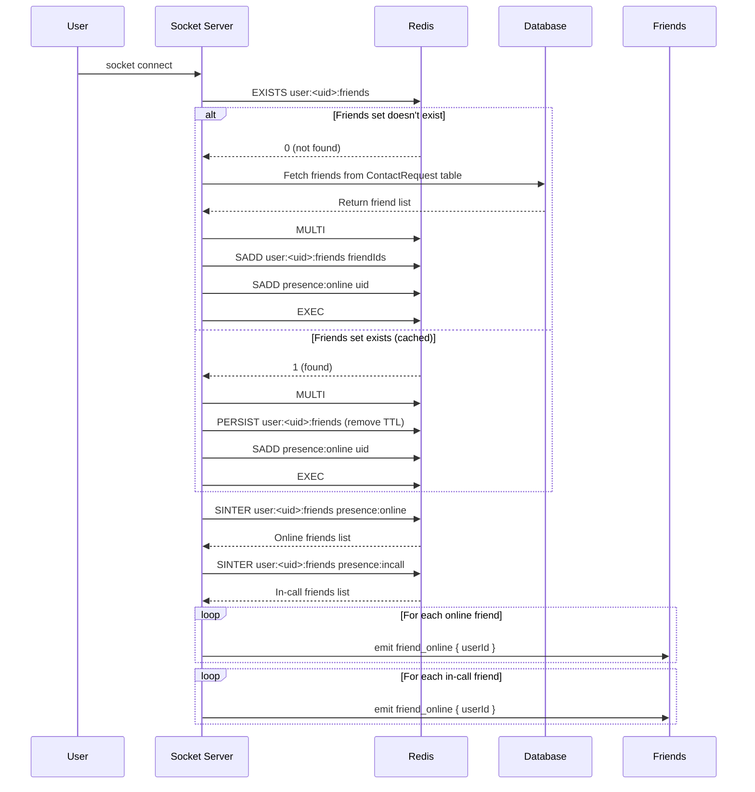
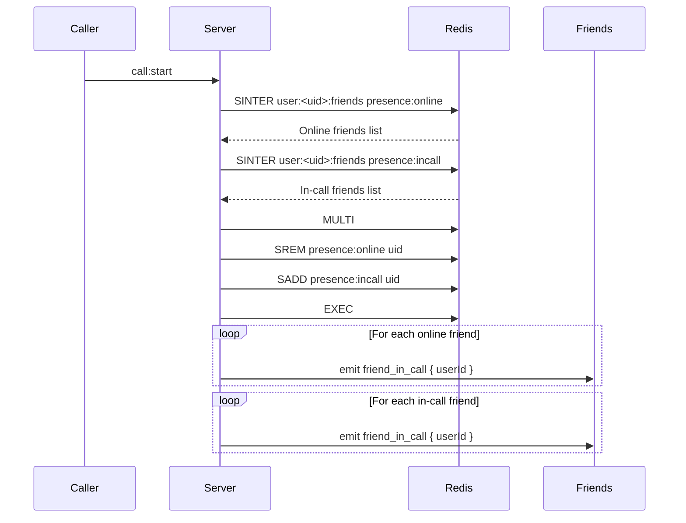
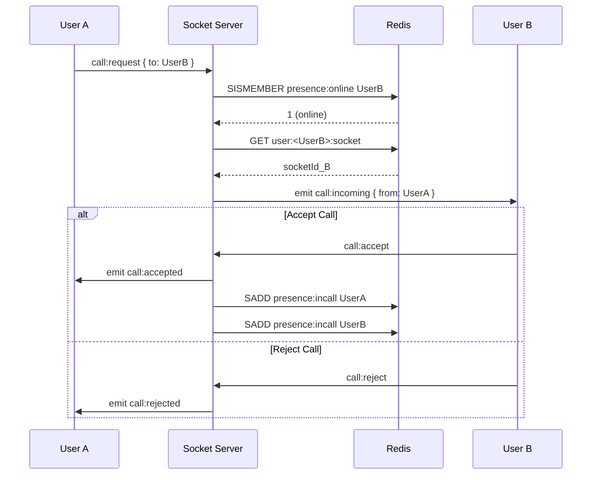
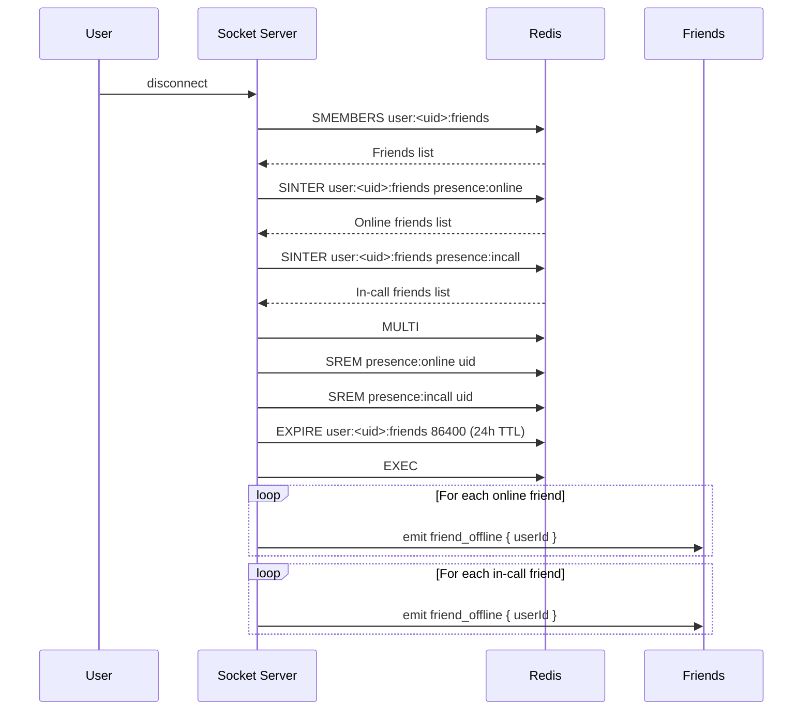
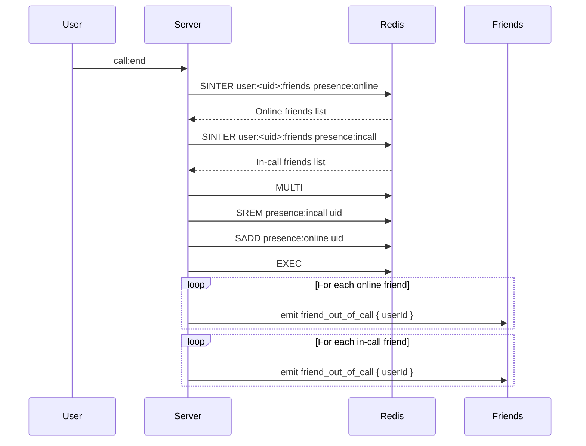

# Redis Presence & Call State Management

> Comprehensive Redis schema and event architecture for real-time presence tracking and call state management in a distributed VoIP system.

---

## Table of Contents

- [Overview](#overview)
- [Redis Models](#redis-models)
  - [Global Presence Sets](#global-presence-sets)
  - [Per-User Friend State](#per-user-friend-state)
  - [User Metadata](#user-metadata)
- [Redis Key Schema](#redis-key-schema)
- [Socket Events](#socket-events)
  - [Incoming Events](#incoming-events-from-client--server)
  - [Outgoing Events](#outgoing-events-from-server--client)
- [Server Methods](#server-methods)
- [Status Fetch APIs](#status-fetch-apis)
- [Event Flow Diagrams](#event-flow-diagrams)

---

## Overview

The presence system supports:

- **Online / Offline detection** - Real-time tracking of user connectivity
- **In-call / Not-in-call state** - Track active voice calls
- **Friend → online mapping** - Quick lookup of online friends
- **Friend → in-call mapping** - Quick lookup of friends currently in calls
- **Efficient updates** - Instant propagation when users join/leave/start-call/end-call
- **Socket.IO event propagation** - Real-time notifications to connected clients

### Why Redis?

- **Horizontal scaling** - Multi-instance deployment support
- **Stateless backend** - Any server instance can handle any request
- **Crash-safe state** - State persists across server restarts
- **Multi-instance Socket.IO** - Shared state across Socket.IO instances

---

## Redis Models

### Global Presence Sets

Global state representing all users across the system.

| Key | Type | Description |
|-----|------|-------------|
| `presence:online` | Set | Contains `userId` of all currently online users |
| `presence:incall` | Set | Contains `userId` of all users currently in a call |

---

### Per-User Friend State

Each user maintains cached sets for efficient friend status lookups.

| Key Pattern | Type | Description |
|-------------|------|-------------|
| `user:<uid>:friends` | Set | List of friend `userId`s |
| `user:<uid>:friends:online` | Set | Which of the user's friends are online |
| `user:<uid>:friends:incall` | Set | Which friends are currently in a call |

---

### User Metadata

Stores individual user connection and status information.

| Key Pattern | Type | Description |
|-------------|------|-------------|
| `user:<uid>:socket` | String | Stores current active `socketId` |
| `user:<uid>:status` | String | User status: `"online"`, `"offline"`, or `"incall"` |

---

## Redis Key Schema

```redis
# Global presence tracking
presence:online                -> Set(userId)
presence:incall                -> Set(userId)

# Per-user friend mappings
user:<uid>:friends             -> Set(friendUserId)
user:<uid>:friends:online      -> Set(friendUserId)
user:<uid>:friends:incall      -> Set(friendUserId)

# User metadata
user:<uid>:socket              -> String(socketId)
user:<uid>:status              -> String("online" | "offline" | "incall")
```

---

## Socket Events

### Incoming Events (from client → server)

| Event Name | Purpose |
|------------|---------|
| `user:connect` | User connects to socket |
| `user:disconnect` | User disconnects |
| `call:start` | User starts a WebRTC call |
| `call:end` | User ends the call |
| `call:request` | User initiates calling a friend |
| `call:accepted` | Friend accepts WebRTC call |
| `call:rejected` | Friend rejects call |

---

### Outgoing Events (from server → client)

| Event Name | Purpose |
|------------|---------|
| `friend_online` | A friend came online |
| `friend_offline` | A friend went offline |
| `friend_in_call` | A friend started a call |
| `friend_out_of_call` | A friend ended a call |
| `call:incoming` | Incoming call request |
| `call:accepted` | Call accepted by other user |
| `call:rejected` | Call rejected |
| `call:ended` | Peer ended the call |

---

## Server Methods

Core methods the server must implement for presence and call state management.

---

### 1. `onUserConnected(uid, socketId)`

Called when a user successfully connects to the Socket.IO server.

**Redis Updates:**
```redis
SADD presence:online uid
SET user:<uid>:socket socketId
SET user:<uid>:status "online"
```

**Update Friends:**

For each friend `F`:
```redis
SADD user:<F>:friends:online uid
```

**Emits:**
```javascript
emit('friend_online', { userId: uid }) -> to all friends
```

---

### 2. `onUserDisconnected(uid)`

Called when a user disconnects from the Socket.IO server.

**Redis Updates:**
```redis
SREM presence:online uid
SREM presence:incall uid
DEL user:<uid>:socket
SET user:<uid>:status "offline"
```

**Update Friends:**

For each friend `F`:
```redis
SREM user:<F>:friends:online uid
SREM user:<F>:friends:incall uid
```

**Emits:**
```javascript
emit('friend_offline', { userId: uid }) -> to all friends
```

---

### 3. `onUserStartCall(uid)`

Called when a user starts a voice call.

**Redis Updates:**
```redis
SADD presence:incall uid
SET user:<uid>:status "incall"
```

**Update Friends:**

For each friend `F`:
```redis
SADD user:<F>:friends:incall uid
```

**Emits:**
```javascript
emit('friend_in_call', { userId: uid }) -> to all friends
```

---

### 4. `onUserEndCall(uid)`

Called when a user ends a voice call.

**Redis Updates:**
```redis
SREM presence:incall uid
SET user:<uid>:status "online"
```

**Update Friends:**

For each friend `F`:
```redis
SREM user:<F>:friends:incall uid
```

**Emits:**
```javascript
emit('friend_out_of_call', { userId: uid }) -> to all friends
```

---

### 5. `onUserCallRequest(fromUser, toUser)`

Called when a user initiates a call to another user.

**Workflow:**

1. Check if `toUser` is online
2. Emit `call:incoming` to socket of `toUser`

**Redis (Optional):**

You may optionally store call metadata:
```redis
call:<fromUser>:target = toUser
call:<toUser>:from = fromUser
```

**Emits:**
```javascript
emit('call:incoming', { from: fromUser }) -> to toUser
```

---

## Status Fetch APIs

Quick lookup methods for user and friend status.

**Check if a user is online:**
```redis
SISMEMBER presence:online <uid>
```

**Check if a user is in-call:**
```redis
SISMEMBER presence:incall <uid>
```

**Get online friends:**
```redis
SMEMBERS user:<uid>:friends:online
```

**Get friends in-call:**
```redis
SMEMBERS user:<uid>:friends:incall
```

---

## Event Flow Diagrams

### User Connection Sequence



---

### User Start Call Sequence



---

### Call Request Flow



---

### User Disconnect Sequence



---

### User End Call Sequence



---

## Implementation Checklist

- ~~[x] Setup Redis client connection~~
- ~~[x] Implement `onUserConnected` handler~~
- ~~[x] Implement `onUserDisconnected` handler~~
- ~~[x] Implement `onUserStartCall` handler~~
- ~~[x] Implement `onUserEndCall` handler~~
- ~~[x] Implement `onUserCallRequest` handler~~
- ~~[x] Add error handling for Redis operations~~
- [ ] Update Redis on accepting the contact request
- [ ] Add Redis connection retry logic
- [ ] Implement status fetch API endpoints
- [ ] Add logging for debugging
- [ ] Test multi-instance Socket.IO setup
- [ ] Implement call timeout logic
- [ ] Add Redis key expiration policies (optional)
