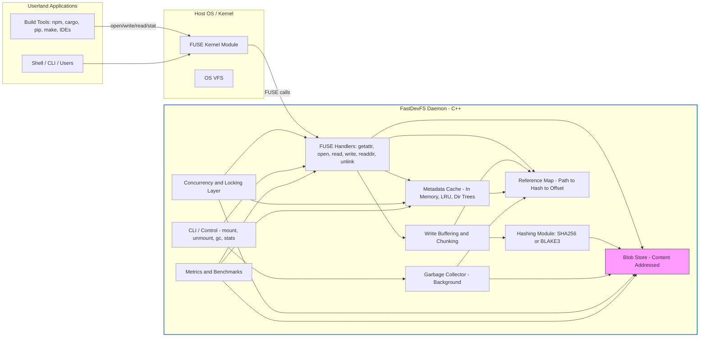
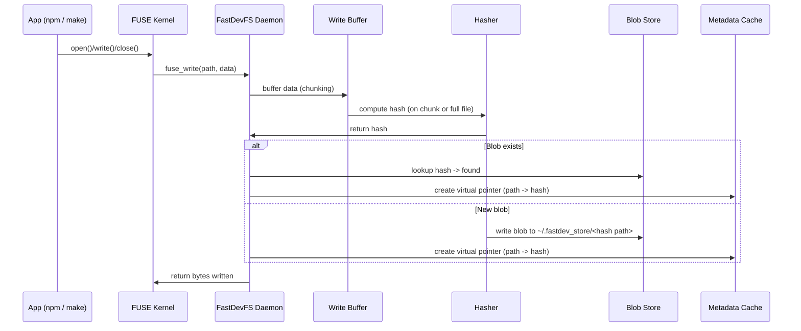
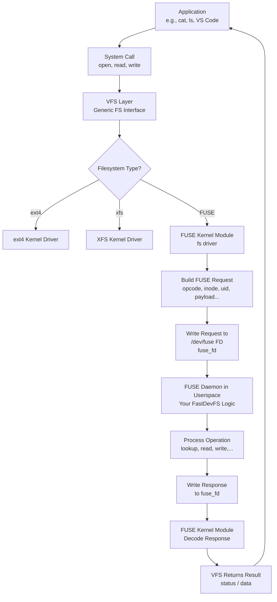

```mermaid
graph LR

%% ---------- Host OS ----------
subgraph HostOS[Host OS / Kernel]
    KERNEL[FUSE Kernel Module]
    VFS[OS VFS]
end

%% ---------- FastDevFS Daemon ----------
subgraph FastDevFS_Daemon[FastDevFS Daemon - C++]
    FD_HANDLERS[FUSE Handlers: getattr, open, read, write, readdir, unlink]
    METACACHE[Metadata Cache - In Memory, LRU, Dir Trees]
    WRITE_PIPE[Write Buffering and Chunking]
    HASHER[Hashing Module: SHA256 or BLAKE3]
    BLOB_STORE[Blob Store - Content Addressed]
    REF_MAP[Reference Map - Path to Hash to Offset]
    GC[Garbage Collector - Background]
    LOCKS[Concurrency and Locking Layer]
    CLI[CLI / Control - mount, unmount, gc, stats]
    METRICS[Metrics and Benchmarks]
end

%% ---------- Userland ----------
subgraph Apps[Userland Applications]
    BUILD_TOOLS[Build Tools: npm, cargo, pip, make, IDEs]
    USER_SHELL[Shell / CLI / Users]
end

%% ---------- Edges ----------
BUILD_TOOLS -->|open/write/read/stat| KERNEL
USER_SHELL --> KERNEL
KERNEL -->|FUSE calls| FD_HANDLERS

FD_HANDLERS --> METACACHE
FD_HANDLERS --> WRITE_PIPE
FD_HANDLERS --> REF_MAP
FD_HANDLERS --> BLOB_STORE

WRITE_PIPE --> HASHER
WRITE_PIPE --> REF_MAP
HASHER --> BLOB_STORE

METACACHE --> REF_MAP

GC --> BLOB_STORE
GC --> REF_MAP

LOCKS --> FD_HANDLERS
LOCKS --> METACACHE
LOCKS --> BLOB_STORE

CLI --> FD_HANDLERS
CLI --> GC

METRICS --> FD_HANDLERS
METRICS --> BLOB_STORE
METRICS --> METACACHE

%% ---------- Styling ----------
style FastDevFS_Daemon stroke:#0b5fff,stroke-width:2px
style BLOB_STORE fill:#f9f,stroke:#333,stroke-width:1px
```

```mermaid
sequenceDiagram
participant App as App (npm / make)
participant K as FUSE Kernel
participant FD as FastDevFS Daemon
participant W as Write Buffer
participant H as Hasher
participant S as Blob Store
participant M as Metadata Cache


App->>K: open()/write()/close()
K->>FD: fuse_write(path, data)
FD->>W: buffer data (chunking)
W->>H: compute hash (on chunk or full file)
H->>FD: return hash
alt Blob exists
FD->>S: lookup hash -> found
FD->>M: create virtual pointer (path -> hash)
else New blob
H->>S: write blob to ~/.fastdev_store/<hash path>
FD->>M: create virtual pointer (path -> hash)
end
FD->>K: return bytes written
```

```mermaid
flowchart TD

    A[Application<br/>e.g., cat, ls, VS Code] 
        --> B[System Call<br/>open, read, write]

    B --> C[VFS Layer<br/>Generic FS Interface]

    C --> D{Filesystem Type?}

    D -->|ext4| E1[ext4 Kernel Driver]
    D -->|xfs| E2[XFS Kernel Driver]
    D -->|FUSE| F[FUSE Kernel Module<br/>fs driver]

    F --> G[Build FUSE Request<br/>opcode, inode, uid, payload...]

    G --> H[Write Request to<br/>/dev/fuse FD<br/>fuse_fd]

    H --> I[FUSE Daemon in Userspace<br/>Your FastDevFS Logic]

    I --> J[Process Operation<br/>lookup, read, write,...]

    J --> K[Write Response<br/>to fuse_fd]

    K --> L[FUSE Kernel Module<br/>Decode Response]

    L --> M[VFS Returns Result<br/>status / data]

    M --> A

```